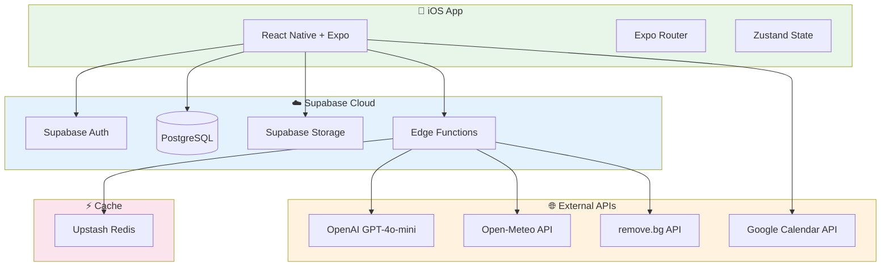

# Vestiaire Fullstack Architecture Document

This document outlines the complete fullstack architecture for Vestiaire, including backend systems, frontend implementation, and their integration. It serves as the single source of truth for AI-driven development.

---

## Introduction

### Starter Template

**N/A - Greenfield project** using React Native + Expo with Supabase backend.

### Change Log

| Date | Version | Description | Author |
|------|---------|-------------|--------|
| 2026-01-21 | 1.0 | Initial Architecture Document | Winston (Architect) |

---

## High Level Architecture

### Technical Summary

Vestiaire is a mobile-first iOS application built with React Native and Expo, backed by Supabase for authentication, database, storage, and serverless Edge Functions. The architecture follows a modern JAMstack-inspired pattern with serverless backend, PostgreSQL database, and Redis caching. OpenAI GPT-4o-mini powers the AI outfit recommendation engine. The system is designed for rapid development, low operational cost, and easy scalability from MVP to production.

### Platform and Infrastructure

| Aspect | Choice |
|--------|--------|
| **Platform** | Supabase + Expo EAS |
| **Key Services** | Supabase Auth, PostgreSQL, Storage, Edge Functions, Upstash Redis |
| **Deployment Regions** | EU (GDPR compliance) |
| **Frontend Hosting** | Expo EAS Build → TestFlight → App Store |
| **Backend Hosting** | Supabase Cloud (managed) |

### Repository Structure

| Aspect | Choice |
|--------|--------|
| **Structure** | Monorepo |
| **Monorepo Tool** | npm workspaces (simple, no extra tooling) |
| **Package Organization** | `apps/mobile`, `packages/shared`, `supabase/` |

### Architecture Diagram



### Architectural Patterns

- **Serverless-First:** Supabase Edge Functions for all backend logic — no server management
- **Component-Based UI:** React Native components with TypeScript — maintainable and type-safe
- **Repository Pattern:** Data access abstracted through service layer — testable and flexible
- **Optimistic UI:** Update UI immediately, sync with backend — fast perceived performance
- **Event-Driven Gamification:** Points/badges triggered by database events — decoupled logic

---

## Tech Stack

| Category | Technology | Version | Purpose | Rationale |
|----------|------------|---------|---------|-----------|
| Frontend Language | TypeScript | 5.3+ | Type safety | Industry standard, prevents bugs |
| Frontend Framework | React Native | 0.73+ | Cross-platform mobile | iOS now, Android-ready |
| Expo SDK | Expo | 52+ | Development tooling | Faster builds, OTA updates, EAS |
| UI Framework | NativeWind | 4.0+ | Styling | Tailwind syntax, rapid UI |
| Navigation | Expo Router | 3.0+ | File-based routing | Modern, type-safe routing |
| State Management | Zustand | 4.5+ | Client state | Simple, minimal boilerplate |
| Server State | TanStack Query | 5.0+ | API caching | Automatic refetch, cache |
| Backend | Supabase | Latest | BaaS platform | Auth, DB, Storage, Functions |
| Database | PostgreSQL | 15+ | Relational data | Robust, RLS built-in |
| Cache | Upstash Redis | Serverless | API caching | Reduces AI costs |
| Storage | Supabase Storage | Latest | Image storage | Signed URLs, private buckets |
| Auth | Supabase Auth | Latest | Authentication | Email, Apple Sign-In |
| AI | OpenAI | gpt-4o-mini | Outfit generation | Fast, cost-effective |
| Image Processing | remove.bg | API | Background removal | Industry-leading quality |
| Weather | Open-Meteo | Free | Weather data | No API key required |
| Push Notifications | Expo Push | Latest | Notifications | Native iOS push |
| Testing | Jest + RNTL | Latest | Unit tests | React Native standard |
| E2E Testing | Maestro | Latest | E2E tests | Mobile-native, visual |
| CI/CD | GitHub Actions + EAS | Latest | Build pipeline | TestFlight automation |
| Error Tracking | Sentry | Latest | Crash reporting | Industry standard |

---

## Data Models

### User

**Purpose:** Core user account and profile

```typescript
interface User {
  id: string;                    // UUID
  email: string;
  display_name: string | null;
  avatar_url: string | null;
  premium_until: Date | null;
  created_at: Date;
  updated_at: Date;
}
```

### Item (Clothing)

**Purpose:** Individual wardrobe item

```typescript
interface Item {
  id: string;                    // UUID
  user_id: string;               // FK → users
  name: string | null;
  category: Category;            // enum
  sub_category: string | null;
  color: string;                 // hex or name
  brand: string | null;
  purchase_price: number | null;
  purchase_date: Date | null;
  image_url: string;             // processed (no bg)
  original_image_url: string;    // original
  seasons: Season[];             // array
  occasions: Occasion[];         // array
  is_favorite: boolean;
  wear_count: number;
  last_worn_at: Date | null;
  created_at: Date;
}

type Category = 'tops' | 'bottoms' | 'dresses' | 'outerwear' | 'shoes' | 'accessories';
type Season = 'spring' | 'summer' | 'fall' | 'winter' | 'all';
type Occasion = 'casual' | 'work' | 'formal' | 'sport' | 'night_out';
```

### Outfit

**Purpose:** Saved outfit combination

```typescript
interface Outfit {
  id: string;                    // UUID
  user_id: string;               // FK → users
  name: string | null;
  occasion: Occasion | null;
  is_ai_generated: boolean;
  weather_context: WeatherContext | null;
  created_at: Date;
}

interface OutfitItem {
  outfit_id: string;             // FK → outfits
  item_id: string;               // FK → items
  position: 'top' | 'bottom' | 'shoes' | 'accessory' | 'outerwear';
}
```

### WearLog

**Purpose:** Track daily outfit wearing

```typescript
interface WearLog {
  id: string;                    // UUID
  user_id: string;               // FK → users
  outfit_id: string | null;      // FK → outfits
  worn_at: Date;
  occasion: Occasion | null;
}

interface WearLogItem {
  wear_log_id: string;           // FK → wear_logs
  item_id: string;               // FK → items
}
```

### UserStats

**Purpose:** Gamification and analytics

```typescript
interface UserStats {
  user_id: string;               // PK, FK → users
  level: number;                 // 1-6
  style_points: number;
  current_streak: number;
  longest_streak: number;
  last_active_date: Date;
  ai_suggestions_today: number;
  resale_listings_month: number;
}
```

### Badge

**Purpose:** Achievement system

```typescript
interface Badge {
  id: string;                    // UUID
  name: string;
  description: string;
  category: 'upload' | 'engagement' | 'sustainability' | 'secret';
  icon: string;
  requirement: string;           // JSON logic
}

interface UserBadge {
  user_id: string;               // FK → users
  badge_id: string;              // FK → badges
  earned_at: Date;
}
```

### ResaleListing

**Purpose:** Track resale activity

```typescript
interface ResaleListing {
  id: string;                    // UUID
  user_id: string;               // FK → users
  item_id: string;               // FK → items
  title: string;
  description: string;
  status: 'draft' | 'listed' | 'sold' | 'cancelled';
  created_at: Date;
}
```

---

## Database Schema (PostgreSQL)

```sql
-- Users (managed by Supabase Auth, extended with profiles)
CREATE TABLE profiles (
  id UUID PRIMARY KEY REFERENCES auth.users(id) ON DELETE CASCADE,
  display_name TEXT,
  avatar_url TEXT,
  premium_until TIMESTAMPTZ,
  created_at TIMESTAMPTZ DEFAULT NOW(),
  updated_at TIMESTAMPTZ DEFAULT NOW()
);

-- Items
CREATE TABLE items (
  id UUID PRIMARY KEY DEFAULT gen_random_uuid(),
  user_id UUID NOT NULL REFERENCES profiles(id) ON DELETE CASCADE,
  name TEXT,
  category TEXT NOT NULL CHECK (category IN ('tops', 'bottoms', 'dresses', 'outerwear', 'shoes', 'accessories')),
  sub_category TEXT,
  color TEXT NOT NULL,
  brand TEXT,
  purchase_price DECIMAL(10,2),
  purchase_date DATE,
  image_url TEXT NOT NULL,
  original_image_url TEXT NOT NULL,
  seasons TEXT[] DEFAULT '{}',
  occasions TEXT[] DEFAULT '{}',
  is_favorite BOOLEAN DEFAULT FALSE,
  wear_count INTEGER DEFAULT 0,
  last_worn_at TIMESTAMPTZ,
  created_at TIMESTAMPTZ DEFAULT NOW()
);

CREATE INDEX idx_items_user_id ON items(user_id);
CREATE INDEX idx_items_category ON items(category);

-- Outfits
CREATE TABLE outfits (
  id UUID PRIMARY KEY DEFAULT gen_random_uuid(),
  user_id UUID NOT NULL REFERENCES profiles(id) ON DELETE CASCADE,
  name TEXT,
  occasion TEXT,
  is_ai_generated BOOLEAN DEFAULT FALSE,
  weather_context JSONB,
  created_at TIMESTAMPTZ DEFAULT NOW()
);

CREATE TABLE outfit_items (
  id UUID PRIMARY KEY DEFAULT gen_random_uuid(),
  outfit_id UUID NOT NULL REFERENCES outfits(id) ON DELETE CASCADE,
  item_id UUID NOT NULL REFERENCES items(id) ON DELETE CASCADE,
  position TEXT NOT NULL
);

-- Wear Logging
CREATE TABLE wear_logs (
  id UUID PRIMARY KEY DEFAULT gen_random_uuid(),
  user_id UUID NOT NULL REFERENCES profiles(id) ON DELETE CASCADE,
  outfit_id UUID REFERENCES outfits(id) ON DELETE SET NULL,
  worn_at DATE NOT NULL DEFAULT CURRENT_DATE,
  occasion TEXT,
  created_at TIMESTAMPTZ DEFAULT NOW()
);

CREATE TABLE wear_log_items (
  wear_log_id UUID NOT NULL REFERENCES wear_logs(id) ON DELETE CASCADE,
  item_id UUID NOT NULL REFERENCES items(id) ON DELETE CASCADE,
  PRIMARY KEY (wear_log_id, item_id)
);

-- Gamification
CREATE TABLE user_stats (
  user_id UUID PRIMARY KEY REFERENCES profiles(id) ON DELETE CASCADE,
  level INTEGER DEFAULT 1,
  style_points INTEGER DEFAULT 0,
  current_streak INTEGER DEFAULT 0,
  longest_streak INTEGER DEFAULT 0,
  last_active_date DATE,
  ai_suggestions_today INTEGER DEFAULT 0,
  resale_listings_month INTEGER DEFAULT 0
);

CREATE TABLE badges (
  id UUID PRIMARY KEY DEFAULT gen_random_uuid(),
  name TEXT NOT NULL UNIQUE,
  description TEXT,
  category TEXT NOT NULL,
  icon TEXT,
  requirement JSONB
);

CREATE TABLE user_badges (
  user_id UUID NOT NULL REFERENCES profiles(id) ON DELETE CASCADE,
  badge_id UUID NOT NULL REFERENCES badges(id) ON DELETE CASCADE,
  earned_at TIMESTAMPTZ DEFAULT NOW(),
  PRIMARY KEY (user_id, badge_id)
);

-- Resale
CREATE TABLE resale_listings (
  id UUID PRIMARY KEY DEFAULT gen_random_uuid(),
  user_id UUID NOT NULL REFERENCES profiles(id) ON DELETE CASCADE,
  item_id UUID NOT NULL REFERENCES items(id) ON DELETE CASCADE,
  title TEXT NOT NULL,
  description TEXT NOT NULL,
  status TEXT DEFAULT 'draft',
  created_at TIMESTAMPTZ DEFAULT NOW()
);

-- RLS Policies
ALTER TABLE profiles ENABLE ROW LEVEL SECURITY;
ALTER TABLE items ENABLE ROW LEVEL SECURITY;
ALTER TABLE outfits ENABLE ROW LEVEL SECURITY;
ALTER TABLE wear_logs ENABLE ROW LEVEL SECURITY;
ALTER TABLE user_stats ENABLE ROW LEVEL SECURITY;
ALTER TABLE user_badges ENABLE ROW LEVEL SECURITY;
ALTER TABLE resale_listings ENABLE ROW LEVEL SECURITY;

-- Example RLS Policy (users can only access their own data)
CREATE POLICY "Users can view own items" ON items
  FOR SELECT USING (auth.uid() = user_id);

CREATE POLICY "Users can insert own items" ON items
  FOR INSERT WITH CHECK (auth.uid() = user_id);

CREATE POLICY "Users can update own items" ON items
  FOR UPDATE USING (auth.uid() = user_id);

CREATE POLICY "Users can delete own items" ON items
  FOR DELETE USING (auth.uid() = user_id);
```

---

## API Specification (Supabase Edge Functions)

### Edge Functions

| Function | Purpose | Trigger |
|----------|---------|---------|
| `process-image` | Background removal + categorization | POST /functions/v1/process-image |
| `generate-outfit` | AI outfit suggestions | POST /functions/v1/generate-outfit |
| `generate-listing` | AI resale listing text | POST /functions/v1/generate-listing |
| `get-weather` | Fetch weather data | GET /functions/v1/get-weather |
| `check-freemium` | Validate usage limits | Called by other functions |

### Generate Outfit API

```typescript
// POST /functions/v1/generate-outfit
interface GenerateOutfitRequest {
  weather: {
    temp: number;
    condition: string;
    feels_like: number;
  };
  events: {
    title: string;
    time: string;
    occasion?: string;
  }[];
  preferences?: {
    style?: string;
    exclude_items?: string[];
  };
}

interface GenerateOutfitResponse {
  suggestions: {
    id: string;
    name: string;
    items: string[];  // item IDs
    rationale: string;
    occasion_match: string;
  }[];
  remaining_today: number;  // freemium limit
}
```

### Process Image API

```typescript
// POST /functions/v1/process-image
interface ProcessImageRequest {
  image_base64: string;  // or image_url
}

interface ProcessImageResponse {
  processed_url: string;
  original_url: string;
  category: string;
  sub_category: string | null;
  colors: string[];
  confidence: number;
}
```

---

## Project Structure

```
vestiaire/
├── .github/
│   └── workflows/
│       ├── ci.yml              # Lint, test
│       └── eas-build.yml       # EAS Build → TestFlight
├── apps/
│   └── mobile/                 # React Native + Expo
│       ├── app/                # Expo Router pages
│       │   ├── (auth)/         # Auth screens
│       │   │   ├── sign-in.tsx
│       │   │   ├── sign-up.tsx
│       │   │   └── _layout.tsx
│       │   ├── (tabs)/         # Main app tabs
│       │   │   ├── index.tsx   # Home
│       │   │   ├── wardrobe.tsx
│       │   │   ├── add.tsx
│       │   │   ├── outfits.tsx
│       │   │   ├── profile.tsx
│       │   │   └── _layout.tsx
│       │   └── _layout.tsx     # Root layout
│       ├── components/
│       │   ├── ui/             # Design system components
│       │   ├── features/       # Feature-specific components
│       │   └── shared/         # Shared components
│       ├── hooks/              # Custom React hooks
│       ├── services/           # API service layer
│       ├── stores/             # Zustand stores
│       ├── utils/              # Utilities
│       ├── constants/          # App constants
│       ├── types/              # TypeScript types
│       ├── app.json            # Expo config
│       ├── eas.json            # EAS Build config
│       └── package.json
├── packages/
│   └── shared/                 # Shared code
│       ├── types/              # Shared TypeScript types
│       ├── constants/          # Shared constants
│       └── utils/              # Shared utilities
├── supabase/
│   ├── migrations/             # SQL migrations
│   │   └── 001_initial_schema.sql
│   ├── functions/              # Edge Functions
│   │   ├── process-image/
│   │   ├── generate-outfit/
│   │   ├── generate-listing/
│   │   ├── get-weather/
│   │   └── _shared/            # Shared function code
│   └── config.toml             # Supabase config
├── docs/
│   ├── prd.md
│   ├── front-end-spec.md
│   └── architecture.md
├── .env.example
├── package.json                # Root package.json
└── README.md
```

---

## Development Workflow

### Prerequisites

```bash
# Required
node >= 20.0.0
npm >= 10.0.0
iOS Simulator (Xcode)

# Install Expo CLI
npm install -g expo-cli eas-cli

# Install Supabase CLI
brew install supabase/tap/supabase
```

### Initial Setup

```bash
# Clone and install
git clone <repo>
cd vestiaire
npm install

# Setup environment
cp .env.example .env.local
# Fill in Supabase URL, anon key, OpenAI key, etc.

# Start Supabase locally
supabase start

# Run migrations
supabase db push

# Start app
cd apps/mobile
npm run ios
```

### Development Commands

```bash
# Start iOS app
npm run ios

# Start with Expo Go
npm run start

# Run tests
npm test

# Lint
npm run lint

# Type check
npm run typecheck

# Build for TestFlight
eas build --platform ios --profile production
```

### Environment Variables

```bash
# .env.local (mobile app)
EXPO_PUBLIC_SUPABASE_URL=https://xxx.supabase.co
EXPO_PUBLIC_SUPABASE_ANON_KEY=xxx

# Supabase Edge Functions
OPENAI_API_KEY=sk-xxx
REMOVEBG_API_KEY=xxx
UPSTASH_REDIS_URL=xxx
UPSTASH_REDIS_TOKEN=xxx
```

---

## Deployment

### Frontend (iOS)

| Stage | Platform | URL |
|-------|----------|-----|
| Development | Expo Go | Local |
| Staging | TestFlight | Internal |
| Production | App Store | Public |

### Backend (Supabase)

| Environment | Project |
|-------------|---------|
| Development | Local Supabase |
| Production | Supabase Cloud |

### CI/CD Pipeline

```yaml
# .github/workflows/eas-build.yml
name: EAS Build
on:
  push:
    branches: [main]

jobs:
  build:
    runs-on: ubuntu-latest
    steps:
      - uses: actions/checkout@v4
      - uses: actions/setup-node@v4
        with:
          node-version: 20
      - run: npm install
      - uses: expo/expo-github-action@v8
        with:
          eas-version: latest
          token: ${{ secrets.EXPO_TOKEN }}
      - run: eas build --platform ios --profile production --non-interactive
      - run: eas submit --platform ios --latest --non-interactive
```

---

## Security

### Authentication

- **Methods:** Email/Password, Apple Sign-In
- **Token Storage:** expo-secure-store (iOS Keychain)
- **Session Duration:** 7 days
- **JWT Validation:** Supabase handles automatically

### Data Security

- **RLS Policies:** All tables protected
- **Signed URLs:** Private bucket access
- **HTTPS Only:** All API calls encrypted
- **GDPR Compliant:** EU data residency

### API Security

- **Rate Limiting:** Upstash Redis
- **Input Validation:** Zod schemas
- **CORS:** Configured for app only

---

## Performance

| Metric | Target |
|--------|--------|
| App Launch | <2s |
| Image Upload | <5s |
| AI Response | <10s |
| Gallery Load | <500ms |
| Animation | 60fps |

### Optimization Strategies

- **Image caching:** React Query + expo-image
- **Lazy loading:** Virtualized lists
- **Skeleton screens:** Immediate feedback
- **Redis caching:** AI response caching
- **Image compression:** Client-side before upload

---

## Testing Strategy

### Test Pyramid

```
      E2E (Maestro)
         /    \
   Integration (Jest)
      /          \
 Unit (Jest + RNTL)
```

### Test Organization

```
apps/mobile/
├── __tests__/
│   ├── components/     # Component tests
│   ├── hooks/          # Hook tests
│   ├── services/       # API service tests
│   └── stores/         # Store tests
├── e2e/                # Maestro E2E tests
│   ├── auth.yaml
│   ├── add-item.yaml
│   └── outfit-flow.yaml
```

---

## Coding Standards

### Critical Rules

- **Type Sharing:** Import types from `packages/shared`
- **API Calls:** Use service layer, never direct fetch
- **State:** Use Zustand stores, no prop drilling
- **Styling:** NativeWind only, no inline styles
- **Error Handling:** Always use error boundaries

### Naming Conventions

| Element | Convention | Example |
|---------|------------|---------|
| Components | PascalCase | `ItemCard.tsx` |
| Hooks | camelCase + use | `useAuth.ts` |
| Stores | camelCase + Store | `wardrobeStore.ts` |
| Services | camelCase + Service | `outfitService.ts` |
| DB Tables | snake_case | `user_badges` |
| Edge Functions | kebab-case | `generate-outfit` |

---

## Next Steps

1. Initialize Expo project with TypeScript template
2. Set up Supabase project (EU region)
3. Configure EAS Build for iOS
4. Implement Epic 1: Foundation & Authentication
5. Begin parallel Supabase Edge Function development

---

*Document generated by Winston (Architect) — January 21, 2026*
