# Vestiaire UI/UX Specification

This document defines the user experience goals, information architecture, user flows, and visual design specifications for Vestiaire's user interface. It serves as the foundation for visual design and frontend development, ensuring a cohesive and user-centered experience.

---

## Overall UX Goals & Principles

### Target User Personas

| Persona | Description | Primary Needs |
|---------|-------------|---------------|
| **🌿 Eco-Conscious Emma** | Gen Z/Millennial (18-28), fashion-aware, sustainability-focused | Quick outfit ideas, guilt-free shopping, social sharing |
| **⏰ Busy Professional Ben** | Working professional (25-40), time-poor, values convenience | Fast morning decisions, calendar-aware outfits |
| **👗 Wardrobe Maximizer Maya** | Fashion enthusiast (22-35), extensive wardrobe | Analytics, CPW tracking, outfit variety |

### Usability Goals

| Goal | Target Metric |
|------|---------------|
| Ease of Onboarding | First 5 items uploaded within 10 minutes |
| Decision Speed | Outfit selected in under 60 seconds |
| Habit Formation | 40% achieve 7-day streak |
| Feature Discovery | Core features found within 3 sessions |
| Error Recovery | <5% abandonment on errors |

### Design Principles

1. **Inspire, Don't Overwhelm** — Visual-first, details on demand
2. **Reduce to the Essential** — Every tap moves toward the goal
3. **Celebrate Progress** — Rewarding, not manipulative gamification
4. **Respect the Wardrobe** — Clothing photos are the star
5. **Sustainable by Design** — Positive reinforcement, not guilt

### Change Log

| Date | Version | Description | Author |
|------|---------|-------------|--------|
| 2026-01-21 | 1.0 | Initial UI/UX Specification | Sally (UX Expert) |

---

## Information Architecture

### Site Map

```mermaid
graph TD
    subgraph Auth["🔐 Auth"]
        A1[Welcome] --> A2[Sign In]
        A1 --> A3[Sign Up]
        A3 --> A5[Onboarding]
    end

    subgraph Main["📱 App"]
        H[Home] --> W[Wardrobe]
        W --> ADD[Add Item]
        ADD --> O[Outfits]
        O --> P[Profile]
    end

    H --> H1[Today's Outfit]
    W --> W1[Gallery] --> W3[Item Detail]
    O --> O1[AI Suggestions]
    O --> O2[My Outfits]
    P --> P2[Gamification]
    P --> P3[Analytics]
    P --> P4[Settings]
```

### Navigation Structure

**Primary Navigation (Bottom Tab Bar):**

| Tab | Icon | Badge |
|-----|------|-------|
| Home | 🏠 | — |
| Wardrobe | 👗 | Item count |
| Add | ➕ (elevated) | — |
| Outfits | 👔 | New suggestion |
| Profile | 👤 | Streak 🔥 |

**Secondary Navigation:**
- Wardrobe: Category tabs + filter sheet
- Outfits: Segmented control (AI/My/Builder)
- Profile: Scrollable sections

---

## User Flows

### Flow 1: Onboarding

```mermaid
graph TD
    A[Launch] --> B{First Time?}
    B -->|Yes| C[Welcome]
    C --> D[Sign Up]
    D --> E[Style Preferences]
    E --> F[Closet Safari Challenge]
    F --> G[Upload 5 Items]
    G --> H[🎉 AI Unlocked]
```

### Flow 2: Add Item

```mermaid
graph TD
    A[Tap Add] --> B[Camera/Library]
    B --> C[Capture]
    C --> D[Background Removal]
    D --> E[Auto Categorize]
    E --> F[Metadata]
    F --> G[Save ✅]
```

### Flow 3: Morning Outfit

### Flow 4: Wear Logging

```mermaid
graph TD
    A[Evening Notification] --> B[Log Screen]
    B --> C[Select Items/Outfit]
    C --> D[Confirm]
    D --> E[Stats Updated]
    E --> F[Streak +1 🔥]
```

### Flow 5: Resale Listing

---

## Key Screen Layouts

### Home / Today

- Weather widget with temperature
- AI outfit card with composed items
- AI rationale explaining "why this outfit"
- Calendar events with occasion tags
- Quick action for wear logging

### Wardrobe Gallery

- Masonry grid (2-3 columns)
- Category filter tabs
- CPW color badges
- Neglected item indicators

### Item Detail

- Large zoomable image
- Quick stats (price, CPW, wears)
- Action buttons for suggestions/resale

### AI Suggestions

- Swipeable card stack
- Context bar (weather + events)
- Progress indicator
- Freemium limit tracker

### Analytics Dashboard

- Summary cards (items, value, CPW)
- Sustainability score with progress bar
- Wardrobe distribution chart
- Most worn podium

### Profile & Gamification

- Level progress bar
- Badge collection grid
- Streak display
- Settings navigation

---

## Component Library

| Component | Variants | States |
|-----------|----------|--------|
| **Button** | Primary, Secondary, Ghost, Destructive | Default, Pressed, Disabled, Loading |
| **Card** | Elevated, Outlined, Filled | Default, Pressed, Selected |
| **Item Thumbnail** | Standard, With Badge, With Overlay | Default, Selected, Favorited, Neglected |
| **Badge** | CPW, Count, Status, Achievement | Color-coded |
| **Tab Bar** | 5 tabs | Active, Inactive |
| **Outfit Card** | Swipeable | Default, Swiping, Dismissed |
| **Input Field** | Text, Email, Password, Search | Default, Focused, Error, Disabled |
| **Chip/Tag** | Filter, Category, Occasion | Selected, Unselected |
| **Progress** | Linear, Circular, Steps | — |
| **Modal/Sheet** | Bottom Sheet, Full Modal, Alert | — |

---

## Branding & Style Guide

### Color Palette

| Color | Hex | Usage |
|-------|-----|-------|
| Primary | `#5D4E37` | Headers, primary buttons |
| Secondary | `#F5F0E8` | Backgrounds, cards |
| Accent | `#7D9A78` | CTAs, success, sustainability |
| Accent Alt | `#C4785A` | Highlights, gamification |
| Success | `#4CAF50` | Confirmations |
| Warning | `#FFC107` | Cautions |
| Error | `#E53935` | Errors, destructive |

### Typography

| Element | Size | Weight |
|---------|------|--------|
| H1 | 32px | Bold |
| H2 | 24px | Semibold |
| H3 | 20px | Semibold |
| Body | 16px | Regular |
| Caption | 12px | Medium |

**Font:** Inter (primary), SF Pro (fallback)

### Iconography

- **Library:** Lucide Icons
- **Size:** 24px default
- **Style:** Outlined inactive, filled active

### Spacing

- **Base Unit:** 8px
- **Scale:** 4, 8, 12, 16, 24, 32, 48, 64px
- **Screen Padding:** 16px

---

## Accessibility

**Target:** WCAG 2.1 AA

| Requirement | Specification |
|-------------|---------------|
| Contrast | 4.5:1 minimum |
| Touch Targets | 44x44px minimum |
| Focus Indicators | Visible on all interactive elements |
| Motion | Respect iOS "Reduce Motion" |
| Screen Reader | VoiceOver support |
| Text Scaling | Support Dynamic Type |

---

## Animation

### Motion Principles

1. **Purposeful** — Guides attention
2. **Swift** — Under 300ms
3. **Natural** — Spring physics
4. **Accessible** — Reduce when requested

### Key Animations

| Animation | Duration | Easing |
|-----------|----------|--------|
| Button Press | 100ms | ease-out |
| Card Swipe | 300ms | spring |
| Tab Switch | 200ms | ease-in-out |
| Success Check | 400ms | spring |
| Badge Unlock | 600ms | spring |
| Level Up | 1200ms | custom |

---

## Performance

| Metric | Target |
|--------|--------|
| App Launch | <2s |
| Screen Transition | <100ms |
| Image Load | <500ms |
| AI Response | <10s |
| Animation | 60fps |

**Strategies:**
- Progressive image loading
- Skeleton screens
- Optimistic UI updates
- Lazy loading
- Image caching

---

## Next Steps

1. Create Figma project with design system
2. Build NativeWind component library
3. High-fidelity mockups for priority screens
4. User testing with prototypes
5. Handoff to Architect

### Design Handoff Checklist

- [x] User flows documented
- [x] Component inventory complete
- [x] Accessibility defined
- [x] Brand guidelines incorporated
- [x] Performance goals established

---

*Document generated by Sally (UX Expert) — January 21, 2026*
